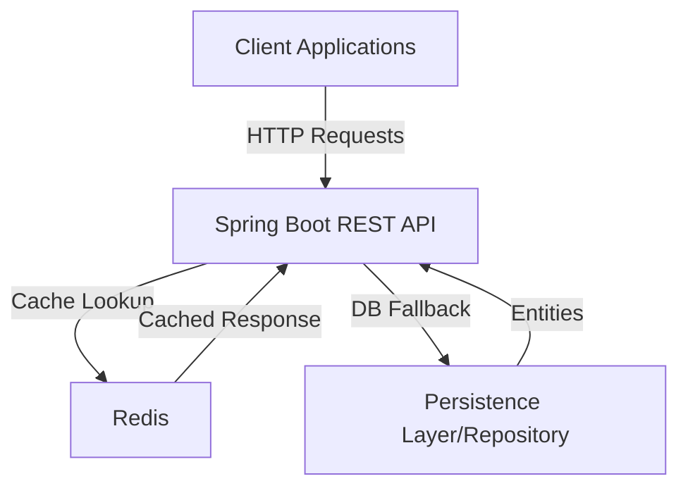

# Redis Caching with Spring Boot and Docker

This project demonstrates how to implement a **Redis-based caching layer** in a **Spring Boot** application,
containerized with **Docker**. It provides a ready-to-use template for speeding up reads, offloading your database, and
validating cache hit/miss behaviors under load.

Common goals:

* Serve frequently requested data from memory
* Reduce repetitive DB calls
* Introduce TTL-based freshness and predictable invalidation
* Benchmark end-to-end latency improvements

---

## 🚀 Features

* Spring Cache + Redis integration (annotation-based)
* Docker & Docker Compose setup for Redis
* Clean CRUD API for `Product` (UUID-based) to exercise cache behavior
* Pluggable TTL, cache names, and key strategies
* Optional Actuator health & metrics endpoints
* Sample curl/Postman flows for quick verification

---

## 🏗️ Architecture



---

## 📋 Prerequisites

* Java 21+
* Maven 3.6+
* Docker & Docker Compose
* (Optional) Postman

---

## 🛠️ Installation & Setup

### 1) Clone

```bash
git clone https://github.com/MenekseYuncu/redis-dockerizer.git
cd redis-dockerizer/caching
```

### 2) Start Redis

```bash
docker-compose up -d
```

Redis will be running at `localhost:6379`.

### 3) Build

```bash
./mvnw clean install
```

### 4) Run

```bash
./mvnw spring-boot:run
```

The service starts on the port defined in `application.yml` (e.g., `8082`).

---

## 🔧 Configuration

`src/main/resources/application.yml` (example):

```yml
spring:
  cache:
    type: redis
    redis:
      time-to-live: 10m
      cache-null-values: false
  data:
    redis:
      host: localhost
      port: 6379
      timeout: 60s

server:
  port: 8082

logging:
  level:
    com.example.caching: INFO
    org.springframework.cache: DEBUG
```

> Make sure `@EnableCaching` is enabled in your main application or configuration class.

---

## 📊 API Endpoints

All endpoints are UUID-based and use the base path **`/api/products`**.

### Product Endpoints

| Method   | Endpoint              | Description                 |
|----------|-----------------------|-----------------------------|
| `GET`    | `/api/products`       | Retrieve all products       |
| `GET`    | `/api/products/{id}`  | Retrieve a product by ID    |
| `POST`   | `/api/products`       | Create a new product        |
| `PUT`    | `/api/products/{id}`  | Update a product            |
| `DELETE` | `/api/products/{id}`  | Delete a product            |
| `GET`    | `/api/products/count` | Get the total product count |

---

## 🧪 Testing

```bash
# Unit tests
./mvnw test

# Integration tests
./mvnw verify
```
### Postman Collection

1. Import the Postman collection from: [Postman Collection](https://www.postman.com/menekse-3683/workspace/redis-dockerizer/folder/24190370-0febdf24-fce3-49ca-81ab-e1f107cc12a5?action=share&creator=24190370&ctx=documentation&active-environment=24190370-d99e8402-c407-471b-9fde-645e24ac3b5f)
2. Set the base URL to `http://localhost:8082`
3. Explore all available endpoints


### Postman / Curl

Base URL example: `http://localhost:8082` (adjust according to your config).

#### 1) Get all products (warm-up cache)

```bash
curl http://localhost:8082/api/products
```

#### 2) Create a product (should invalidate or refresh list cache)

```bash
curl -X POST http://localhost:8082/api/products \
  -H "Content-Type: application/json" \
  -d '{
    "name": "Keyboard",
    "category": "electronics",
    "price": 49.99,
    "description": "Low-profile mechanical"
  }'
```

#### 3) Get by ID (first call = cache miss, subsequent = cache hit)

```bash
curl http://localhost:8082/api/products/<UUID>
```

#### 4) Update product (cache should be refreshed)

```bash
curl -X PUT http://localhost:8082/api/products/<UUID> \
  -H "Content-Type: application/json" \
  -d '{
    "name": "Keyboard Pro",
    "category": "electronics",
    "price": 59.99,
    "description": "Hot-swap switches"
  }'
```

#### 5) Delete product (cache eviction)

```bash
curl -X DELETE http://localhost:8082/api/products/<UUID>
```

#### 6) Count products

```bash
curl http://localhost:8082/api/products/count
```

---

## 🏭 Use Cases

Redis caching is ideal for:

* **Hot data caching**: Frequently accessed products or attributes
* **Database offloading**: Reduce repetitive queries
* **Price/stock lookups**: TTL-based cache for frequently checked values
* **Cache-aside pattern**: Load on read, evict/refresh on write
* **Aggregates**: Store pre-computed counts or stats

---

## ⚙️ Integration Notes

### TTL & Key Strategy

* **TTL**: Set via `spring.cache.redis.time-to-live` (e.g., `10m`).
* **Keys**: Use clear naming (e.g., `productById::<UUID>`, `productList::SimpleKey[]`).
* **Null values**: Typically disabled to avoid caching 404s.

### Performance Considerations

* Caching large lists may cause high memory usage → consider pagination.
* Write-heavy workloads may thrash caches → use selective cache invalidation.
* Use a readable serializer like `GenericJackson2JsonRedisSerializer` for debugging.

---

## 🔒 Security Best Practices

* Enable Redis **AUTH/ACL** and **TLS** in production
* Never expose Redis directly to the internet
* Rotate credentials regularly and monitor access patterns
* Use VPC/Private network setups in cloud deployments

---

## 🤝 Contributing

1. Fork the repo
2. Create your feature branch (`git checkout -b feature/amazing-feature`)
3. Commit your changes (`git commit -m 'Add some amazing feature'`)
4. Push to the branch (`git push origin feature/amazing-feature`)
5. Open a Pull Request

---

## 🙏 Acknowledgments

* [Spring Data Redis](https://spring.io/projects/spring-data-redis)
* [Redis Documentation](https://redis.io/solutions/caching/)
* [Docker](https://www.docker.com/)

