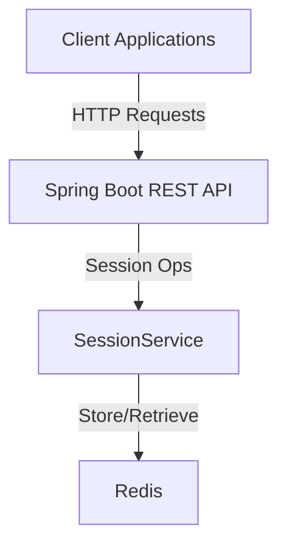

# Redis Key Management (Session Service) with Spring Boot and Docker

This project demonstrates how to implement **Redis-backed session management** using **Spring Boot** and **Docker**. It provides a ready-to-use template for login, session retrieval, validation, extension, logout, and user-wide session termination.

Sessions are managed as Redis keys with TTL, enabling:

* Stateless APIs with centralized session control
* Fast session lookups
* Expiration-based invalidation
* Multi-session users and bulk termination

## 🚀 Features

* Redis-powered session store (fast reads/writes)
* Login, validate, extend, logout, terminate-all endpoints
* Multi-session per user; list active sessions
* Client IP capture (`X-Forwarded-For` / `X-Real-IP` aware)
* Error handling with `UnauthorizedException` & `NotFoundException`
* CORS enabled for all origins (demo-friendly)
* Optional Actuator health/metrics

## 🏗️ Architecture



## 📋 Prerequisites

* Java 21 or higher
* Maven 3.6 or higher
* Docker & Docker Compose
* (Optional) Postman for API testing

## 🛠️ Installation & Setup

### 1) Clone

```bash
git clone https://github.com/MenekseYuncu/redis-dockerizer.git
cd redis-dockerizer/key-management
```

### 2) Start Redis

```bash
docker-compose up -d
```

Redis will be available on `localhost:6379`.

### 3) Build

```bash
./mvnw clean install
```

### 4) Run

```bash
./mvnw spring-boot:run
```

The service starts at `http://localhost:<your-port>` (configure in `application.yml`).

## 🔧 Configuration

`src/main/resources/application.yml` (example):

```yml
spring:
  data:
    redis:
      host: localhost
      port: 6379
      timeout: 60s

server:
  port: 8083  # change as you prefer

logging:
  level:
    com.redisdockerizer.keymanagement: DEBUG
    org.springframework.data.redis: DEBUG
```

> Note: Session TTL and key patterns are handled inside `SessionService`. Adjust there as needed for your policies (e.g., default TTL, sliding extension).

## 📊 API Endpoints

All endpoints are under the base path **`/api/sessions`**.

### Session Endpoints

| Method   | Endpoint                                    | Description                                 |
| -------- | ------------------------------------------- | ------------------------------------------- |
| `POST`   | `/api/sessions/login`                       | Authenticate and create a session.          |
| `GET`    | `/api/sessions/{sessionId}`                 | Get session details by ID.                  |
| `DELETE` | `/api/sessions/{sessionId}/logout`          | Logout (delete) a session by ID.            |
| `GET`    | `/api/sessions/active`                      | Get all active session IDs.                 |
| `GET`    | `/api/sessions/user/{userId}`               | Get all active session IDs for a user.      |
| `PUT`    | `/api/sessions/{sessionId}/extend`          | Extend a session by minutes (default `30`). |
| `DELETE` | `/api/sessions/user/{userId}/terminate-all` | Terminate all sessions for a user.          |
| `POST`   | `/api/sessions/validate?sessionId=...`      | Validate a session and return user info.    |

## 🧪 Testing

```bash
# Unit tests
./mvnw test

# Integration tests
./mvnw verify
```
### Postman Collection

1. Import the Postman collection from: [Postman Collection](https://www.postman.com/menekse-3683/workspace/redis-dockerizer/folder/24190370-bb3c4ae2-3e6b-4478-ad9b-6e197a4fbaff?action=share&source=copy-link&creator=24190370)
2. Set the base URL to `http://localhost:8083`
3. Explore all available endpoints


### Postman / cURL

> Replace `8083` with your configured port.

#### 1) Login

**Request**

```bash
curl -X POST http://localhost:8083/api/sessions/login \
  -H "Content-Type: application/json" \
  -d '{"username":"alice","password":"secret"}'
```

**Sample Response**

```json
{
  "sessionId": "sess_f521099429074d818cb8fa1010e17218",
  "userId": 10,
  "username": "alice",
  "roles": ["USER"],
  "expiresAt": "2025-08-31T22:33:52.538465",
  "message": "Login successful"
}
```

#### 2) Get Session by ID

```bash
curl http://localhost:8083/api/sessions/<SessionId>
```
**Sample Response**

```json
{
  "sessionId": "sess_716d0de39f66402dbecff0a01c99eb2b",
  "userId": 10,
  "username": "alice",
  "roles": ["USER"],
  "createdAt": "2025-08-31T22:03:34.816054",
  "expiresAt": "2025-08-31T22:33:34.816054",
  "clientIp": "0:0:0:0:0:0:0:1"
}
```

**404** if not found or expired.

#### 3) Validate Session

```bash
curl -X POST "http://localhost:8083/api/sessions/validate?sessionId=a1b2c3d4e5f6..."
```

**Sample Response**

```json
{
  "valid": true,
  "userId": 10,
  "username": "alice",
  "roles": ["USER"],
  "error": null
}
```

#### 4) Extend Session (default 30 minutes)

```bash
curl -X PUT "http://localhost:8083/api/sessions/<SessionId>/extend?minutes=45"
```

**Sample Response**

```json
{
  "message": "Session extended successfully",
  "sessionId": "sess_043196ed83b3444da3c17d63eedd039e",
  "extendedByMinutes": 45
}
```

#### 5) Logout

```bash
curl -X DELETE http://localhost:8083/api/sessions/<SessionId>/logout
```

**Sample Response**

```json
{
  "message": "Logout successful",
  "data": { "sessionId": "sess_711as3..." }
}
```

#### 6) List Active Sessions

```bash
curl http://localhost:8083/api/sessions/active
```

**Sample Response**

```json
{
  "activeSessions": [
    "sess_716d0de39f66402dbecff0a01c99eb2b"
  ],
  "count": 1
}
```

#### 7) Get User’s Sessions

```bash
curl http://localhost:8083/api/sessions/user/<UserId>
```

**Sample Response**

```json
{
  "userId": 10,
  "sessions": ["sess_71...","sess_74..."],
  "count": 1
}
```

#### 8) Terminate All Sessions for a User

```bash
curl -X DELETE http://localhost:8083/api/sessions/user/<UserId>/terminate-all
```

**Sample Response**

```json
{
  "message": "User sessions terminated",
  "userId": 10,
  "terminatedCount": 2
}
```

## 🏭 Use Cases

* **Centralized session validation** for stateless microservices
* **Multi-session users** (e.g., web + mobile) with per-user oversight
* **Bulk logout / kill-switch** for compromised accounts
* **Short-lived access** with TTL & sliding extension
* **Audit & monitoring** via active session listing

## ⚙️ Integration Notes

* **CORS**: `@CrossOrigin(origins = "*")` is enabled for demo convenience—restrict in production.
* **IP Extraction**: The controller uses `X-Forwarded-For` → `X-Real-IP` → `remoteAddr`. Ensure your proxy sets these headers.
* **TTL / Sliding Extension**: Implemented in `SessionService`. Choose a default TTL and extend logic that fits your security posture.
* **Error Semantics**:

    * `UnauthorizedException` for invalid/expired sessions (e.g., during validation)
    * `NotFoundException` for missing sessions (e.g., logout/get by ID/extend)

### (Optional) Example Redis Key Strategy

> Actual key names may differ in your implementation; adjust as needed.

* `session:{sessionId}` → session hash / JSON with TTL
* `user:{userId}:sessions` → set of session IDs
* `sessions:active` → set of active session IDs

## 🔒 Security Best Practices

* Enable Redis **AUTH/ACL** and **TLS** in production
* Do **not** expose Redis directly to the public internet
* Rotate secrets regularly; monitor access logs
* Consider IP/device binding and max session limits per user
* Use short TTLs and explicit refresh flows for sensitive apps

## 🤝 Contributing

1. Fork the repository
2. Create a feature branch (`git checkout -b feature/amazing-feature`)
3. Commit your changes (`git commit -m 'Add some amazing feature'`)
4. Push the branch (`git push origin feature/amazing-feature`)
5. Open a Pull Request

## 🙏 Acknowledgments

- [Spring Data Redis](https://spring.io/projects/spring-data-redis)
- [Redis Official Documentation](https://redis.io/documentation)
- [Docker](https://www.docker.com/)
- [Postman](https://www.postman.com/)
