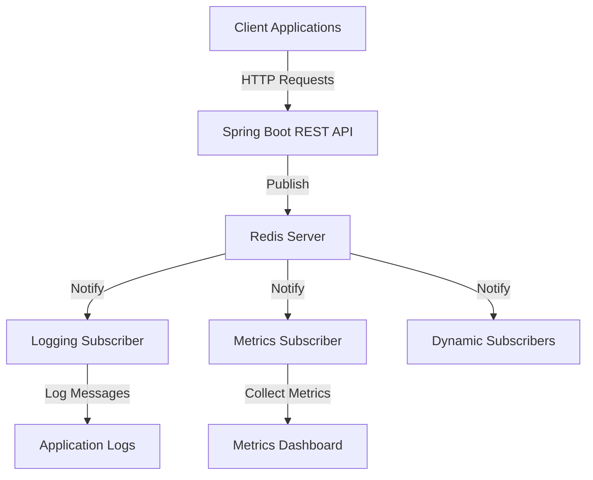

# Redis Pub/Sub with Spring Boot and Docker

This project demonstrates how to implement a Redis Pub/Sub architecture using Spring Boot and Docker. It provides a ready-to-use template for building real-time messaging systems, event-driven architectures, and channel-based communication patterns.

Redis Pub/Sub follows a publish/subscribe messaging paradigm where:
- **Publishers** send messages to specific channels
- **Subscribers** receive messages from channels they're listening to
- Messages are ephemeral and not persisted (for persistence, consider Redis Streams)

## 🚀 Features

-  Redis Pub/Sub implementation with Spring Data Redis
-  Docker containerization with Docker Compose
-  RESTful APIs for message publishing and subscription management
-  Multiple subscriber types (Logging, Metrics)
-  Channel-based messaging system
-  Thread pool configuration for concurrent message processing
-  Health checks and metrics endpoints
-  Pre-loaded sample messages
-  Comprehensive Postman collection for testing

## 🏗️ Architecture



## 📋 Prerequisites

- Java 21 or higher
- Maven 3.6 or higher
- Docker & Docker Compose
- (Optional) Postman for API testing

## 🛠️ Installation & Setup

### 1. Clone the Repository

```bash
git clone https://github.com/MenekseYuncu/redis-dockerizer.git
cd redis-dockerizer/pubsub
```

### 2. Start Redis with Docker Compose

```bash
docker-compose up -d
```

Redis will be available on `localhost:6379`

### 3. Build the Project

```bash
./mvnw clean install
```

### 4. Run the Spring Boot Application

```bash
./mvnw spring-boot:run
```

The service will start on `http://localhost:8084`

## 🔧 Configuration

Application properties can be configured in `src/main/resources/application.yml`:

```yml
# Redis Configuration
redis:
  host: localhost  
  port: 6379    

# Server Configuration
server:
  port: 8084

# Logging Configuration
logging:
  level:
    com.example.redispubsub: DEBUG
    org.springframework.data.redis: DEBUG
```

## 📊 API Endpoints

### Message Endpoints

| Method | Endpoint | Description |
|--------|----------|-------------|
| `POST` | `/api/messages` | Publish a single message |
| `POST` | `/api/messages/batch` | Publish multiple messages |
| `POST` | `/api/messages/replay` | Replay initial 100 messages |

### Channel Endpoints

| Method | Endpoint | Description |
|--------|----------|-------------|
| `POST` | `/api/channels/{room}/subscribe` | Subscribe to a channel |
| `POST` | `/api/channels/{room}/unsubscribe` | Unsubscribe from a channel |
| `GET` | `/api/channels/subscriptions` | Get active subscriptions |

### System Endpoints

| Method | Endpoint | Description |
|--------|----------|-------------|
| `GET` | `/api/metrics` | Get message metrics |
| `GET` | `/api/health` | Health check endpoint |

## 🧪 Testing

### Running Tests

```bash
# Unit tests
./mvnw test

# Integration tests
./mvnw verify
```

### Postman Collection

1. Import the Postman collection from: [Postman Collection](https://www.postman.com/menekse-3683/workspace/redis-dockerizer/folder/24190370-9952a059-b3ad-4923-83a5-15f25771b078?action=share&source=copy-link&creator=24190370)
2. Set the base URL to `http://localhost:8084`
3. Explore all available endpoints

### Example Usage

#### Publishing a Message

```bash
curl -X POST http://localhost:8084/api/pubsub/messages \
  -H "Content-Type: application/json" \
  -d '{
    "channel": "demo.chat.general",
    "user": "alice",
    "text": "Hello everyone!"
  }'
```

#### Subscribing to a Channel

```bash
curl -X POST http://localhost:8084/api/pubsub/channels/random/subscribe
```

#### Getting Metrics

```bash
curl http://localhost:8084/api/metrics
```

## 🏭 Use Cases

Redis Pub/Sub is ideal for scenarios requiring low-latency, real-time message distribution:

- **Real-time notifications**: Order status updates, alert systems, monitoring signals
- **Chat and messaging systems**: Channel-based conversations, group chats, direct messaging
- **Event-driven microservices**: Broadcasting domain events across service boundaries
- **Live data dashboards**: Real-time metrics, IoT sensor updates, sports scores
- **WebSocket/SSE integration**: Backend fan-out for multiple application instances
- **Online presence systems**: Tracking user online/offline status in real-time

## ⚙️ Integration Notes

### Delivery Semantics
- Redis Pub/Sub provides **at-most-once** delivery with no persistence
- For guaranteed message delivery and persistence, consider using **Redis Streams**
- Offline subscribers will miss messages sent while disconnected

### Spring Integration Patterns
- **Publishing**: Use `RedisTemplate.convertAndSend(channel, message)`
- **Subscribing**: Configure `RedisMessageListenerContainer` with `MessageListener` implementations

### Scalability Considerations
- Multiple service instances will each receive published messages (fan-out pattern)
- Use domain-oriented channel naming conventions (e.g., `orders.created`, `users.status`)
- For high availability, consider Redis Sentinel, Cluster, or managed Redis services

## 🔒 Security Best Practices

- Always enable Redis AUTH/ACL in production environments
- Implement TLS encryption for secure communications
- Never run unsecured Redis instances in production
- Regularly rotate credentials and monitor access patterns

## 🤝 Contributing

We welcome contributions! Please feel free to submit pull requests, open issues, or suggest new features.

1. Fork the repository
2. Create your feature branch (`git checkout -b feature/amazing-feature`)
3. Commit your changes (`git commit -m 'Add some amazing feature'`)
4. Push to the branch (`git push origin feature/amazing-feature`)
5. Open a Pull Request

## 🙏 Acknowledgments

- [Spring Data Redis](https://spring.io/projects/spring-data-redis)
- [Redis Official Documentation](https://redis.io/documentation)
- [Docker](https://www.docker.com/)
- [Postman](https://www.postman.com/)

---

