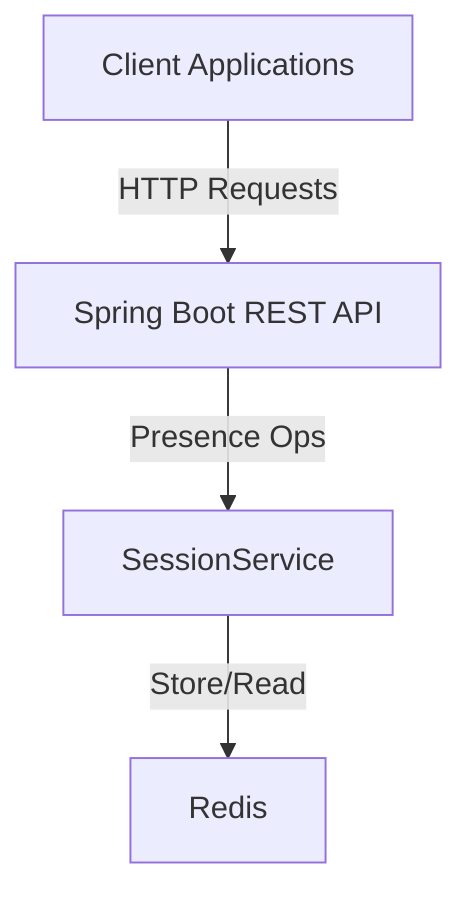

# Redis Session Management (User Presence) with Spring Boot and Docker

This project demonstrates **Redis-backed session & presence management** using **Spring Boot** and **Docker**. It provides a ready-to-use template to mark users online/offline, refresh session TTL, list active users by status, compute session stats, and remove users entirely.

Designed for:

* Real-time **online/offline presence** tracking
* **TTL-based** session expiration
* Lightweight APIs for dashboards or gateways
* Simple benchmarking of Redis operations

---

## 🚀 Features

* Redis-powered presence & session TTL
* Clean REST API for users and sessions
* Aggregate **session statistics** (online/offline/percent)
* Explicit **online/offline** state transitions
* **Refresh TTL** endpoint to keep users active
* Remove user (session + record)
* Optional Actuator health/metrics

---

## 🏗️ Architecture



---

## 📋 Prerequisites

* Java 21+
* Maven 3.6+
* Docker & Docker Compose
* (Optional) Postman

---

## 🛠️ Installation & Setup

### 1) Clone

```bash
git clone https://github.com/MenekseYuncu/redis-dockerizer.git
cd redis-dockerizer/session-management
```

### 2) Start Redis

```bash
docker-compose up -d
```

Redis will be available on `localhost:6379`.

### 3) Build

```bash
./mvnw clean install
```

### 4) Run

```bash
./mvnw spring-boot:run
```

The service starts on the port defined in `application.yml` (e.g., `8085`).

---

## 🔧 Configuration

`src/main/resources/application.yml` (example):

```yml
spring:
  data:
    redis:
      host: localhost
      port: 6379
      timeout: 60s

server:
  port: 8085

logging:
  level:
    com.example.redispubsub: DEBUG
    org.springframework.data.redis: DEBUG

```

> TTL values and key strategy are implemented in `SessionService`. Adjust there to fit your policies (default TTL, sliding TTL on refresh, etc.).

---

## 📊 API Endpoints

**Base path:** `/api`

### Users & Sessions

| Method   | Endpoint                         | Description                                                  |
| -------- | -------------------------------- | ------------------------------------------------------------ |
| `GET`    | `/users`                         | List **all users**.                                          |
| `GET`    | `/sessions/online`               | List users currently **online**.                             |
| `GET`    | `/sessions/offline`              | List users currently **offline**.                            |
| `GET`    | `/sessions/stats`                | Session stats: total, online, offline, online percentage.    |
| `POST`   | `/sessions/{userId}/online`      | Set a user **online**; (re)create session & status with TTL. |
| `POST`   | `/sessions/{userId}/offline`     | Set a user **offline**; remove session & update status.      |
| `POST`   | `/sessions/{userId}/refresh-ttl` | **Refresh session TTL** for a user (keep session active).    |
| `DELETE` | `/users/{userId}`                | **Remove user** entirely (user record + session).            |

> All `{userId}` path variables must be **non-blank**.

---

## 🧪 Testing

```bash
# Unit tests
./mvnw test

# Integration tests
./mvnw verify
```

### Postman Collection

1. Import the Postman collection from: [Postman Collection](https://www.postman.com/menekse-3683/workspace/redis-dockerizer/folder/24190370-315916a0-2ce1-46c6-ab27-6a8648b7c27f?action=share&source=copy-link&creator=24190370)
2. Set the base URL to `http://localhost:8085`
3. Explore all available endpoints


### Postman / cURL

Base URL example: `http://localhost:8085` (adjust to your config).

#### 1) List all users

```bash
curl http://localhost:8085/api/users
```

#### 2) List online users

```bash
curl http://localhost:8085/api/sessions/online
```

#### 3) List offline users

```bash
curl http://localhost:8085/api/sessions/offline
```

#### 4) Session stats

```bash
curl http://localhost:8085/api/sessions/stats
```

**Sample Response (example fields):**

```json
{
  "totalUsers": 50,
  "onlineUsers": 3,
  "offlineUsers": 47,
  "onlinePercentage": 6.0
}
```

#### 5) Set user online

```bash
curl -X POST http://localhost:8085/api/sessions/<UserId>/online
```

**Sample Response (example fields):**

```json
{
  "message": "User set to online successfully",
  "userId": "u10049",
  "username": "jscott",
  "status": "online",
  "ttlSeconds": 300
}
```

#### 6) Set user offline

```bash
curl -X POST http://localhost:8085/api/sessions/<UserId>/offline
```

**Sample Response:**

```json
{
  "message": "User set to offline successfully",
  "userId": "u10049",
  "username": "jscott",
  "status": "offline"
}
```

#### 7) Refresh TTL

```bash
curl -X POST http://localhost:8085/api/sessions/<UserId>/refresh-ttl
```

**Sample Response:**

```json
{
  "message": "User session TTL refreshed successfully",
  "userId": "u10047",
  "username": "feliciawilson",
  "status": "refreshed",
  "ttlSeconds": 300
}
```

#### 8) Remove user

```bash
curl -X DELETE http://localhost:8085/api/users/<UserId>
```

**Sample Response:**

```json
{
  "message": "User removed successfully",
  "userId": "u10047",
  "username": "feliciawilson",
  "status": "removed"
}
```

---

## 🏭 Use Cases

* **Presence dashboards** (who’s online/offline right now)
* **Chat/gaming/collaboration** apps that need quick online-state queries
* **Short-lived sessions** with automatic TTL expiration
* **Load shedding**: keep presence in Redis to offload databases
* **APIs & gateways** needing a fast presence check before routing

---

## ⚙️ Integration Notes

* **Data model** (illustrative — check your `SessionService`):

    * `user:{userId}` → hash/JSON (username, status, lastSeen, ttl)
    * `sessions:online` → set of online user IDs
* **TTL strategy**:

    * **Set Online**: create/update session key with default TTL
    * **Refresh TTL**: extend TTL (sliding expiration)
    * **Set Offline / Remove**: delete session key + update status collections
* **Consistency**: Prefer single-writer or Lua/transactions if your flows need strict atomicity under load.
* **Pagination**: For very large user sets, consider paginated reads for `/online` & `/offline`.

---

## 🔒 Security Best Practices

* Protect these endpoints (auth/authz) — presence is sensitive metadata
* Enable Redis **AUTH/ACL** and **TLS** in production
* Do **not** expose Redis directly to the public internet
* Rate-limit state-changing endpoints (`online`, `offline`, `refresh-ttl`, `remove user`)
* Monitor expirations and error rates via logs/metrics

---

## 🤝 Contributing

1. Fork the repository
2. Create your feature branch (`git checkout -b feature/amazing-feature`)
3. Commit your changes (`git commit -m 'Add some amazing feature'`)
4. Push to the branch (`git push origin feature/amazing-feature`)
5. Open a Pull Request

---

## 🙏 Acknowledgments

- [Spring Data Redis](https://spring.io/projects/spring-data-redis)
- [Redis Official Documentation](https://redis.io/documentation)
- [Docker](https://www.docker.com/)
- [Postman](https://www.postman.com/)
